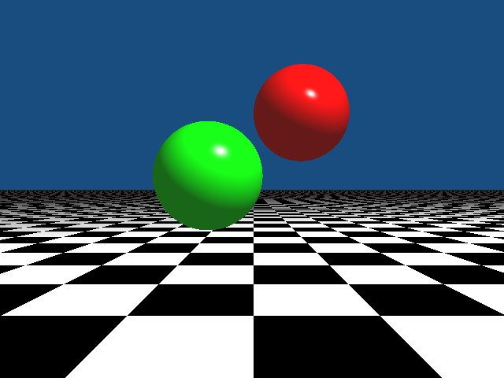

# Simple Ray Tracer in C

This is a simple raytracer that I created, entirely with my own code in C.  

## Usage

```
git clone https://github.com/WyattAutomation/Simple-Raytracer-in-C.git
cd Simple-Raytracer-in-C
make
./a.out
```
The above will output an image called "test1.ppm", which should contain a green and a red sphere, hovering over a checkerboard plane as seen below:




There are 5 primary components to this example, each with their own associated C source and header files:

## Vector Functions (vector.c, vector.h)

These make available several basic functions for working with vectors in 3D Euclidean space.  This includes functions for calculating the sum, difference, and dot product of 2 vectors, as well as a function to scale a vector by an input factor, and another to determine the length of a vector.

## Sphere Intersect Function (sphere.c, sphere.h)

Contains a function for calculating parameterization variables A, B, and C for the quadratic equation "B^2 - 4AC", which is the discriminant of the equation.  It then does a few more things:

-If the discriminant is < 0, the ray doesn't intersect with the sphere, and returns that there is not a hit.

-If the discriminant is above 0, the t0 and t1 intersection points are calculated (t0 and t1 can sort of be considered the points where a ray intersects at the "front" and the "back" of a sphere, t0 here being the visible part that we want to hold onto).

-If t0 < 0.0, it's set to equal the value of t1.

-If after all of the above, t0 > 0.0, it sets 
```
hit = 1
```
meaning that the ray intersected with a sphere.

-Finally, the value of "hit" is returned to indicate if the ray intersected with a sphere (0 for no hit, 1 for hit)

## Plane Intersect Function (plane.c, plane.h)

Contains a function that determines whether a ray intersects with a plane or not, and returns the 3D coordinates of the intersection if it does.  It does this by:

-Calculating the dot product of the plane normal, and the ray direction

-If the value of that is above 0, it calculates the single t value (a plane only has 1 possible intersection point)

-If the T value is > 0, it calculates and returns the coordinates of the intersection as well as sets a flag variable inside the intersection-point variable "ix_point", to indicate that an intersection occured and where.

## Light Functions (light.c, light.h)
Contains very basic Ambient, Diffuse and Specular lighting functions, for use when it is determined that an intersection with an object has occured.  A floor/bitwise function is implmented on intersections with the plane to create a checkerboard pattern as well.

### Lighting Function for Plane

-Ambient lighting is set to a low constant value

-The vectors for the viewpoint, surface normal, and light are initiated and normalized where needed.

-Attentuated lighting is applied only to the plane.  It is calculated using a set of 3 constant variables of differing values (c1, c2, and c3) and the length of the distance from the origin of the plane to a pixel-intersection being processed (dL) as shown below:
```
double atten = 1.0/((c1 * (dL * dL)) + (c2 * dL) + c3);
```
-The value of "atten" is then added to the r, g, and b values for the intersected pixel (which is the color variable RGB)

### Lighting Function for Sphere

-Ambient lighting is set to a low constant value

-The vectors for the viewpoint, surface normal and light are initiated and normalized where needed.

-Diffuse lighting is calculated "cos theta = N dot L", which is the equation for the angle between the light and normal vectors.  This is then multiplied by the current light amounts for r, g, and b, and finally added to the original rgb value of the pixel.

-After that, the equation "L - 2 * (N dot L) * N" to calculate the vector "R", which is the vector between the surface normal and viewpoint vectors, is calculated.

-Finally, specular lighting is calculated using the equation "cosine alpha = dot product of R and V", and then by adding "(cosine alpha^40)" to the rgb values, 40 being a constant to adjust the intensity of specular lighting.


## Raytracer Main (ray.c, ray.h)

This contains data structures for defining the ray, color, plane, sphere, and light data types, and contains the main function of the raytracer.  

-The main function starts off with initializing a function for creating a .ppm file.

-It then initializes all objects within the image, along with object sizes and locations, resolution of the .ppm output, the ppm[] array to store the rgb data for each pixel in the ppm with their coordinates in the image, color levels, and origin of the light source.

-After that, it loops through the ppm array, initializing the origin and direction of the ray as well as the background color for each pixel, determines what lighting or other functions to apply when an intersection with an object is detected, and then stores the rgb pixel data to it's appropriate location inside of the ppm array.

-Finally, the data within the ppm[] array is written to a ppm image named "test1.ppm"
